# 🚗 DriveGuardAI — AI-Powered Driver Safety Monitoring System

[](https://www.java.com)
[](https://spring.io/projects/spring-boot)
[](https://www.python.org)
[](https://reactjs.org)
[](https://kubernetes.io)
[](https://www.docker.com)
[](https://www.postgresql.org)
[](LICENSE)

> A real-time AI driver monitoring system that detects dangerous driving behaviours using computer vision, automatically alerts fleet managers, and tracks driver safety scores — fully containerised and deployed on Kubernetes.

🌐 **Live Demo:** https://driveguard.duckdns.org

---

## 📋 Table of Contents

- [Overview](#overview)
- [Screenshots](#screenshots)
- [Features](#features)
- [Architecture](#architecture)
- [Database Schema](#database-schema)
- [Tech Stack](#tech-stack)
- [Project Structure](#project-structure)
- [API Reference](#api-reference)
- [Getting Started](#getting-started)
- [Kubernetes Deployment](#kubernetes-deployment)
- [CI/CD Pipeline](#cicd-pipeline)
- [Author](#author)

---

## 🎯 Overview

DriveGuardAI is a full-stack fleet management and driver safety platform built for transport companies. It uses a Python AI service with **YOLOv3** and **dlib** to monitor drivers in real time via camera, detecting dangerous behaviours such as drowsiness, phone use, smoking, eating, and distracted driving.

When a violation is detected the system automatically:
- Saves the incident to the **PostgreSQL** database via Spring Boot REST API
- Deducts points from the **driver safety score** (CRITICAL −10, HIGH −5, MEDIUM −3, LOW −1)
- **Auto-suspends** the driver if score drops below 50
- Sends an **email alert** to the fleet manager
- Sends an **SMS alert** via Twilio for critical violations
- Captures a **screenshot** as evidence

---

## 📸 Screenshots

### Dashboard
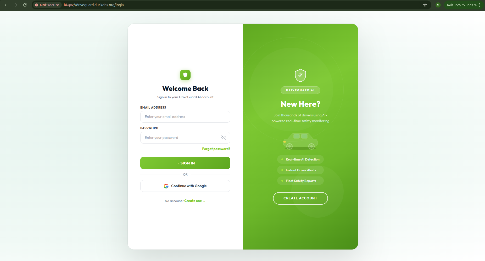

### Login Page
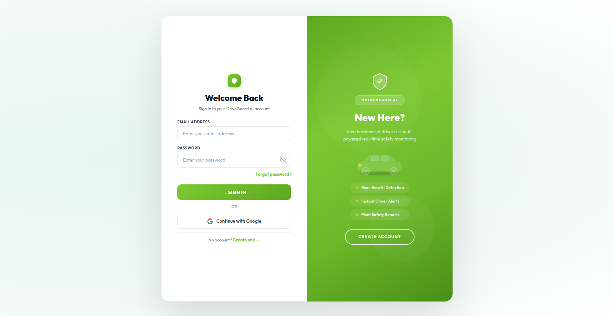

### Driver Management
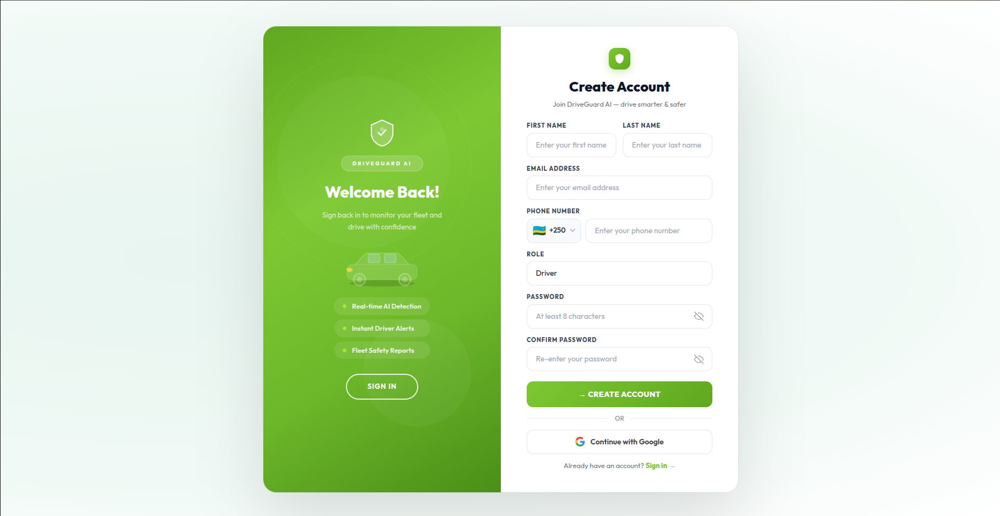

### Vehicle Management
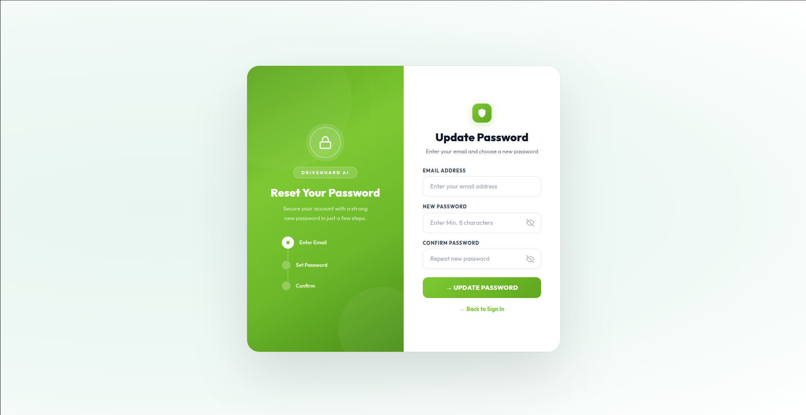

### Trip Management
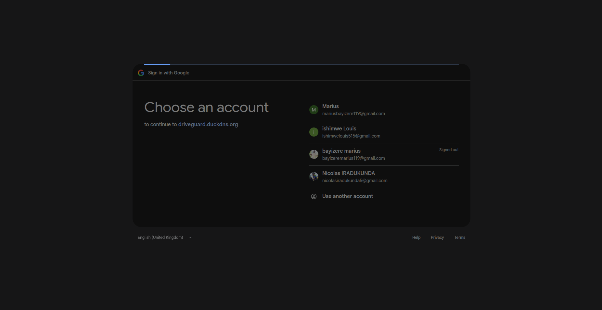

### Live Monitoring Control
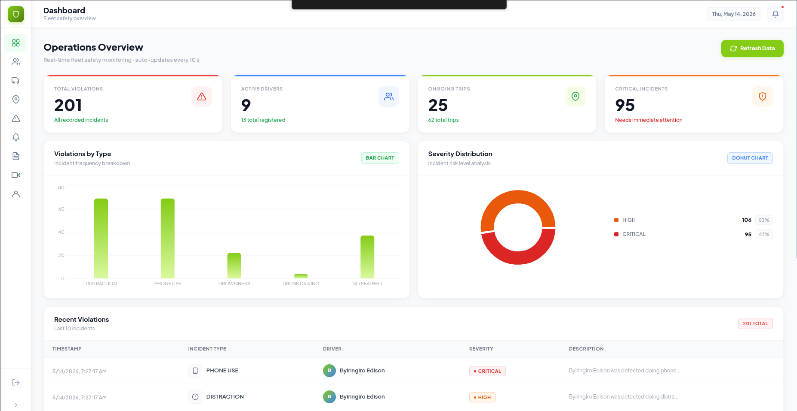

### Live Video Stream
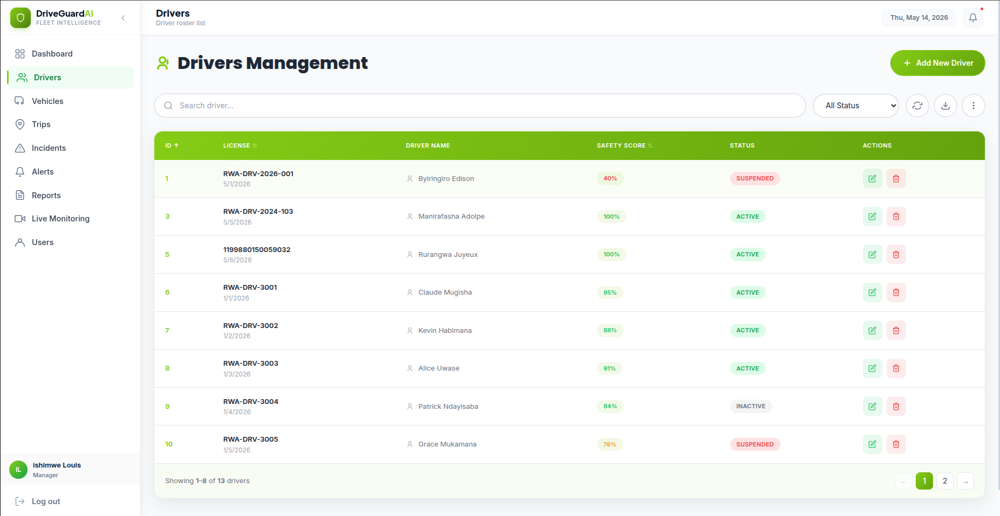

### Incidents & Violations
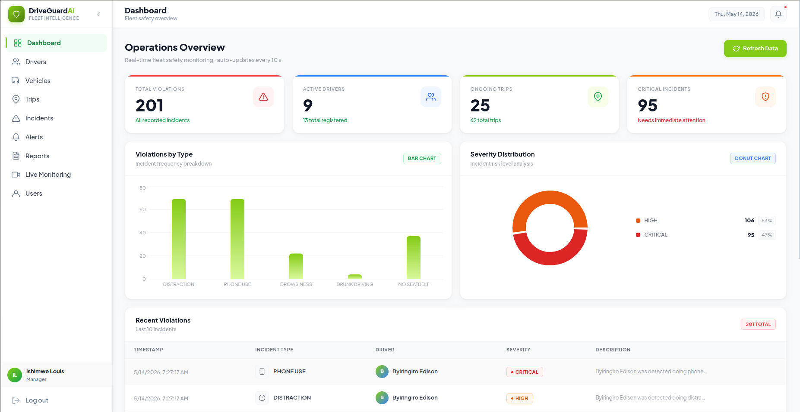

### Safety Score Tracking
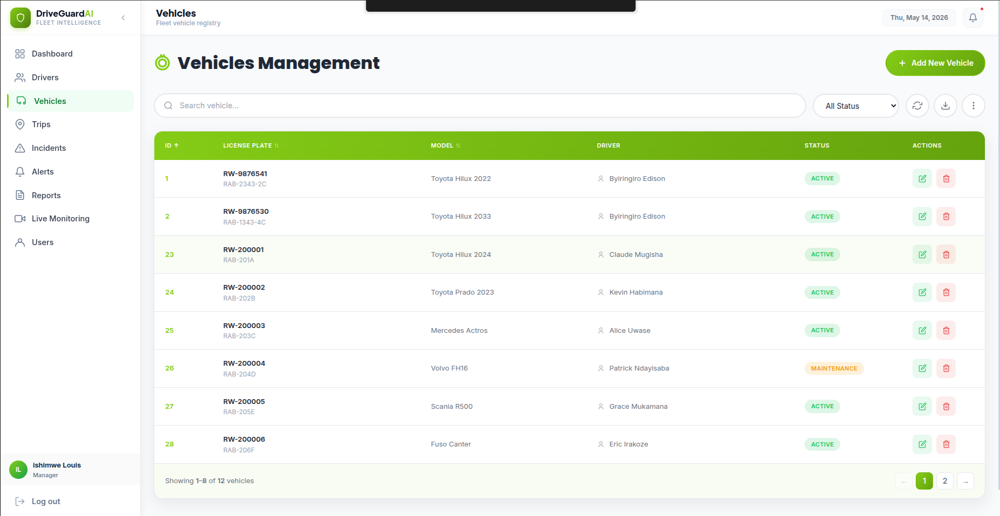

### Alerts System
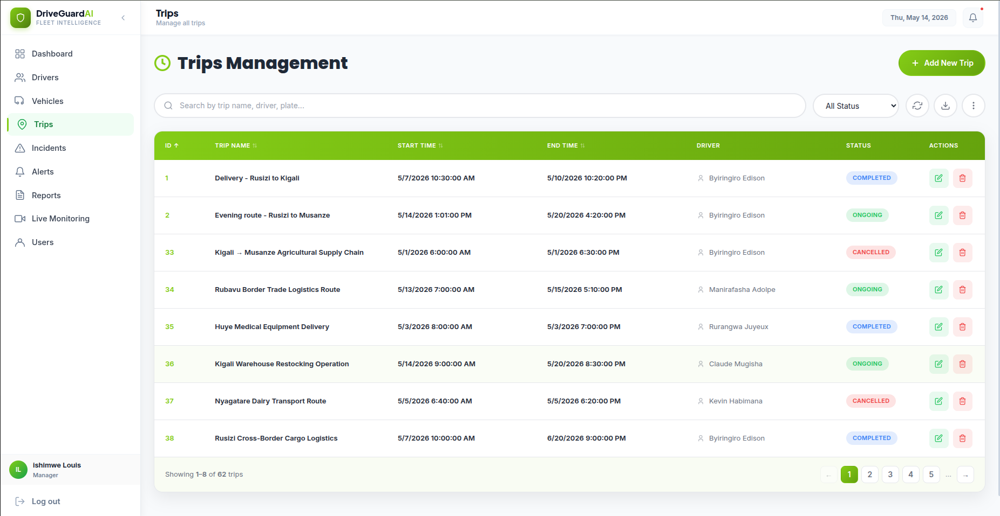

### Reports
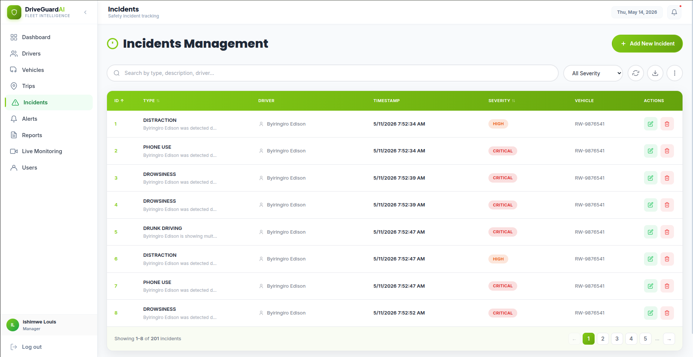

### Driver Profile
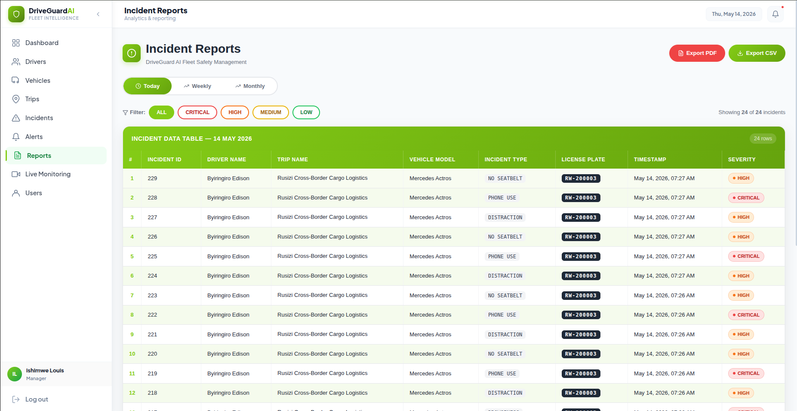

### Fleet Overview
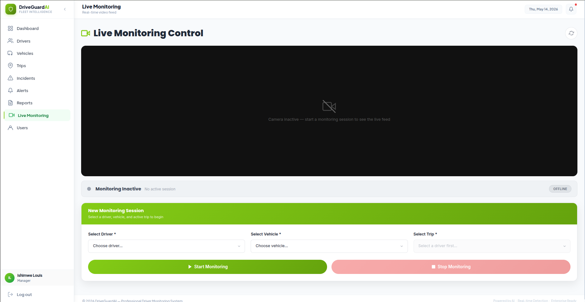

### Violation Detail
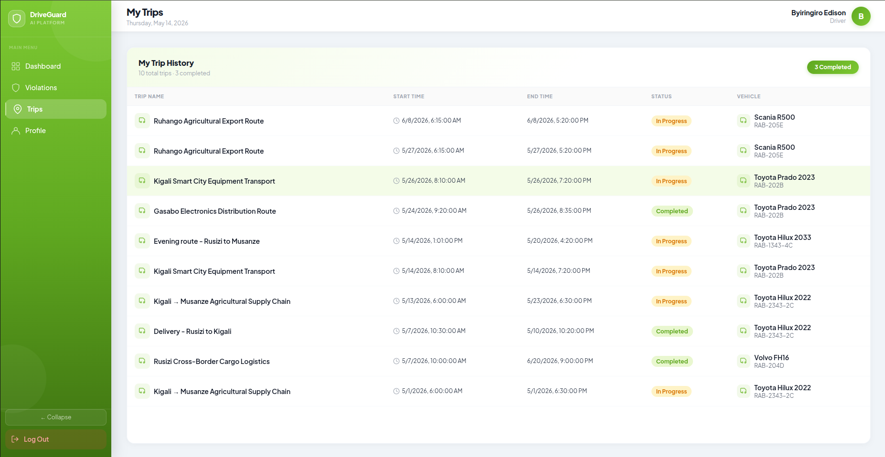

### API Documentation (Swagger)
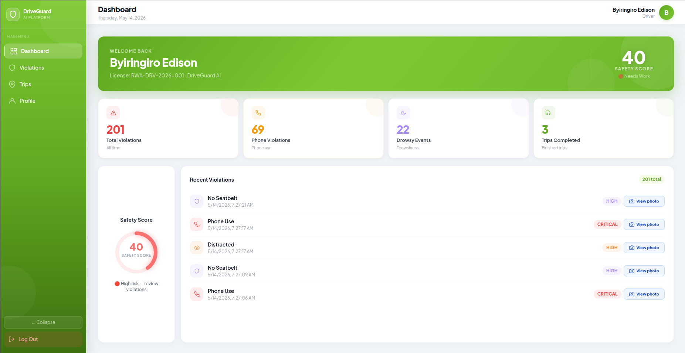

### Kubernetes Cluster
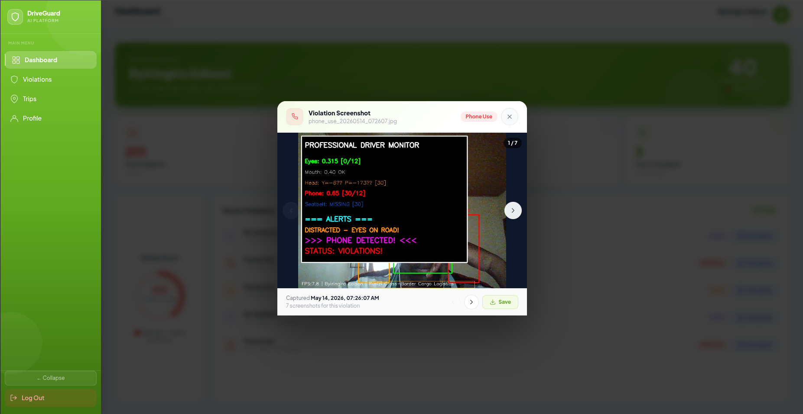

### CI/CD Pipeline
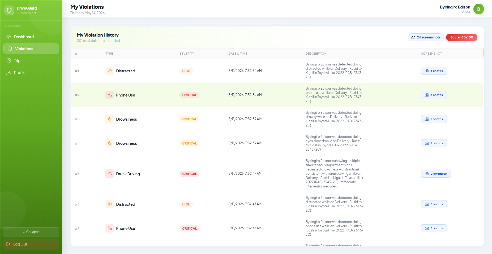

### Mobile View
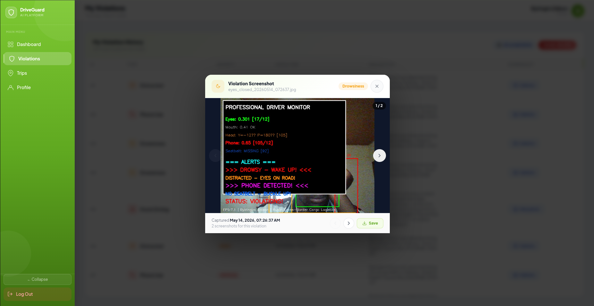

---

## ✨ Features

### 🤖 AI Monitoring (Python/Flask)
- **Drowsiness detection** — Eye Aspect Ratio (EAR) via dlib 68 facial landmarks
- **Distraction detection** — Head pose estimation
- **Phone use detection** — YOLOv3 real-time object detection
- **Smoking detection** — YOLOv3 object detection
- **Eating & drinking detection** — YOLOv3 object detection
- **Seatbelt detection** — computer vision alert
- **Driver face verification** — face_recognition library at session start
- **Drunk driving pattern detection** — behavioural pattern analysis (drowsy + distracted repeatedly)
- **Live MJPEG video stream** — real-time camera feed via Flask
- **Screenshot evidence** — JPEG captured and stored for every violation
- **In-cabin TTS audio alerts** — voice warnings triggered instantly

### 🏢 Backend API (Spring Boot)
- **JWT Authentication** — secure token-based login
- **Google OAuth2** — one-click login with Google
- **Role-based access control** — ADMIN, MANAGER, DRIVER roles
- **Driver management** — full CRUD with safety score tracking
- **Vehicle management** — fleet tracking with status management
- **Trip management** — trip lifecycle (ONGOING, COMPLETED, CANCELLED)
- **Incident management** — violation recording with severity levels
- **Safety score system** — automatic deductions and auto-suspension
- **Alert system** — in-app notifications linked to incidents
- **Email notifications** — Gmail SMTP via Spring Mail
- **Report generation** — today, weekly, monthly incident reports
- **Swagger/OpenAPI 3** — auto-generated interactive API documentation

### 🎨 Frontend Dashboard (React)
- **Live monitoring control** — start/stop monitoring sessions
- **Real-time video stream** — live MJPEG camera feed
- **Driver management** — view, create, update drivers
- **Vehicle management** — manage fleet vehicles
- **Incident history** — view all violations with details
- **Safety score dashboard** — track driver performance
- **Alerts panel** — view and manage system alerts
- **Reports** — daily, weekly, monthly summaries
- **Responsive design** — works on mobile and desktop
- **Google OAuth2 login** — one-click sign in

### ☸️ Infrastructure
- **Kubernetes** — Kind cluster with 3 nodes (control-plane + 2 workers)
- **Nginx Ingress** — path-based routing for 3 services
- **cert-manager** — automated SSL certificates via Let's Encrypt
- **CI/CD** — GitHub Actions automated build and deploy
- **Docker Hub** — image registry (`mariusbayizere/`)
- **DuckDNS** — free dynamic DNS

---

## 🏗️ Architecture

```
Internet
    │
    ▼
┌─────────────────────────────────────────────┐
│         driveguard.duckdns.org              │
│              Nginx Ingress                  │
│                                             │
│  /          → react-service:80              │
│  /api       → springboot-service:8080       │
│  /ai        → flask-service:5000            │
│  /oauth2    → springboot-service:8080       │
│  /login     → springboot-service:8080       │
└──────────┬──────────────┬──────────────┬────┘
           │              │              │
           ▼              ▼              ▼
  ┌──────────────┐ ┌──────────────┐ ┌──────────────────┐
  │ React        │ │ Spring Boot  │ │ Python / Flask   │
  │ Frontend     │ │ REST API     │ │ AI Service       │
  │ port 80      │ │ port 8080    │ │ port 5000        │
  │              │ │              │ │                  │
  │ - Dashboard  │ │ - JWT Auth   │ │ - YOLOv3         │
  │ - Live Feed  │ │ - OAuth2     │ │ - dlib DMS       │
  │ - Monitoring │ │ - CRUD APIs  │ │ - MJPEG Stream   │
  │ - Reports    │ │ - Reports    │ │ - Face Recog     │
  └──────────────┘ └──────┬───────┘ └──────────────────┘
                           │
                  ┌────────▼────────┐
                  │  PostgreSQL 15  │
                  │   port 5432     │
                  └─────────────────┘
```

### Python AI Service Internal Architecture

```
Camera (cv2)
    │
    ▼
monitor.py ──────────────────────────────────────┐
    │                                             │
    ├── driver_monitoring_system_v3_simple.py     │
    │   (drowsy / distracted / seatbelt / yawn)  │
    │                                             │
    ├── detector.py                               │
    │   (YOLOv3 → phone/smoking/eating/drinking)  │
    │   (face_recognition → driver verification)  │
    │                                             │
    └── violation_handler.py                      │
        (screenshot + audio + DB + SMS + email)   │
                │                                 │
                ▼                                 ▼
    api_server.py (Flask REST API)         MJPEG Stream
    /api/monitoring/start                  /api/stream
    /api/monitoring/stop
    /api/monitoring/status
    /api/screenshots
    /api/health
```

---

## 🗄️ Database Schema

```
Users                    Drivers
─────────────────        ─────────────────────
User_ID (PK)    ◄──────► Driver_ID (PK)
First_Name               License_Number
Last_Name                Safety_Score (0-100)
Email                    Driver_Status
Phone_Number             Hire_Date
User_Role                User_ID (FK)
Password

Vehicles                 Trips
─────────────────        ─────────────────────
Vehicle_ID (PK)          Trip_ID (PK)
Model                    Trip_Name
Plate_Number             Start_Time
License_Plate            End_Time
Vehicle_Status           Status
Driver_ID (FK)           Driver_ID (FK)
                         Vehicle_ID (FK)

Incidents                Alerts
─────────────────        ─────────────────────
Incident_ID (PK)         Alert_ID (PK)
Incident_Type            Message
Description              Sent_At
Severity                 Status
Timestamp                Incident_ID (FK)
Driver_ID (FK)           User_ID (FK)
Trip_ID (FK)
Vehicle_ID (FK)
```

**Incident Types:** `DROWSINESS`, `PHONE_USE`, `DISTRACTION`, `NO_SEATBELT`, `FATIGUE`, `SMOKING`, `DRUNK_DRIVING`, `UNAUTHORIZED_DRIVER`, `LANE_DRIFT`, `OTHER`

**Severity Levels:** `LOW` (−1pt), `MEDIUM` (−3pts), `HIGH` (−5pts), `CRITICAL` (−10pts)

**Driver Status:** `ACTIVE`, `INACTIVE`, `SUSPENDED` (auto at score < 50)

---

## 🛠️ Tech Stack

| Layer | Technology |
|-------|-----------|
| **AI/ML Service** | Python 3.11, Flask 3.0, OpenCV, YOLOv3, dlib, face_recognition, PyTorch |
| **Backend API** | Java 21, Spring Boot 4.0.1, Spring Security, JWT (jjwt 0.12.6), OAuth2 |
| **Database** | PostgreSQL 15, Spring Data JPA, Hibernate |
| **Frontend** | React 18, Tailwind CSS, Axios |
| **PDF Reports** | iText 7 |
| **API Docs** | Swagger / SpringDoc OpenAPI 3 |
| **Container** | Docker, Docker Hub |
| **Orchestration** | Kubernetes 1.29 (Kind), Nginx Ingress Controller |
| **SSL** | cert-manager, Let's Encrypt |
| **CI/CD** | GitHub Actions |
| **Notifications** | Gmail SMTP (Spring Mail), Twilio SMS |
| **DNS** | DuckDNS |

---

## 📁 Project Structure

```
DriveGuardAI/
├── src/main/java/com/example/DriveGuardAI/
│   ├── controller/
│   │   ├── UserAutho.java          # Auth: signup, signin, me, update-password
│   │   ├── UsersController.java    # User CRUD
│   │   ├── DriversController.java  # Driver CRUD + by user ID
│   │   ├── VehiclesController.java # Vehicle CRUD
│   │   ├── TripsController.java    # Trip CRUD + by driver
│   │   ├── IncidentsController.java# Incident CRUD + violation + reinstate
│   │   ├── AltersController.java   # Alert CRUD + by user
│   │   ├── ReportController.java   # Today/weekly/monthly reports
│   │   └── NotificationController.java # Email notifications
│   ├── model/
│   │   ├── Users.java
│   │   ├── Drivers.java
│   │   ├── Vehicles.java
│   │   ├── Trips.java
│   │   ├── Incidents.java
│   │   ├── Alters.java
│   │   └── EmailDetails.java
│   ├── Enum/
│   │   ├── UserRole.java           # ADMIN, MANAGER, DRIVER
│   │   ├── DriverStatus.java       # ACTIVE, INACTIVE, SUSPENDED
│   │   ├── IncidentTypes.java      # 12 violation types
│   │   ├── Severity.java           # LOW, MEDIUM, HIGH, CRITICAL
│   │   ├── Trips_Status.java       # ONGOING, COMPLETED, CANCELLED
│   │   ├── VehiclesStatus.java     # ACTIVE, MAINTENANCE, INACTIVE
│   │   └── Alerts_Status.java      # SENT, READ, UNREAD
│   ├── service/                    # Business logic
│   ├── repository/                 # JPA repositories
│   ├── dto/                        # ViolationDTO
│   ├── SecurityConfig/             # JWT + OAuth2
│   ├── exception/                  # Global error handling
│   └── response/                   # AuthResponse
├── driver-dashboard/               # React frontend
│   └── src/
│       ├── components/             # UI components
│       ├── services/api.js         # Axios API calls
│       └── hooks/                  # Custom hooks
├── k8s/                            # Kubernetes manifests
│   ├── deployments/
│   ├── services/
│   ├── ingress/
│   ├── configmaps/
│   └── secrets/
├── python-service/                 # AI monitoring service
│   ├── api_server.py               # Flask REST API entry point
│   ├── monitor.py                  # Camera loop + MJPEG stream
│   ├── detector.py                 # YOLOv3 + face recognition
│   ├── violation_handler.py        # Screenshot + audio + DB + SMS
│   ├── notifications.py            # Twilio SMS + email
│   ├── config.py                   # Environment configuration
│   ├── driver_monitoring_system_v3_simple.py  # DMS core (EAR/head pose)
│   └── yolo/                       # YOLOv3 weights + config
│       ├── yolov3.weights          # Pre-trained weights (237MB)
│       ├── yolov3.cfg
│       └── coco.names
├── docs/screenshots/               # App screenshots
└── .github/workflows/              # CI/CD pipeline
```

---

## 📖 API Reference

### 🔐 Authentication — `/api/v1/auth`

| Method | Endpoint | Description | Auth |
|--------|----------|-------------|------|
| POST | `/api/v1/auth/signup` | Register new user + send welcome email | Public |
| POST | `/api/v1/auth/signin` | Login with email/password → JWT token | Public |
| GET | `/api/v1/auth/me` | Get current logged-in user profile | JWT |
| PUT | `/api/v1/auth/update-password` | Update password + send confirmation email | Public |

### 👥 Users — `/api/v1/users`

| Method | Endpoint | Description | Auth |
|--------|----------|-------------|------|
| GET | `/api/v1/users` | List all users | JWT |
| GET | `/api/v1/users/{id}` | Get user by ID | JWT |
| POST | `/api/v1/users` | Create user | JWT |
| PUT | `/api/v1/users/{id}` | Update user | JWT |
| DELETE | `/api/v1/users/{id}` | Delete user | JWT |

### 🚗 Drivers — `/api/v1/drivers`

| Method | Endpoint | Description | Auth |
|--------|----------|-------------|------|
| GET | `/api/v1/drivers` | List all drivers | JWT |
| GET | `/api/v1/drivers/{id}` | Get driver by driver ID | JWT |
| GET | `/api/v1/drivers/user/{userId}` | Get driver by linked user ID | JWT |
| POST | `/api/v1/drivers` | Create driver (safety score auto-set to 100) | JWT |
| PUT | `/api/v1/drivers/{id}` | Update driver details | JWT |
| DELETE | `/api/v1/drivers/{id}` | Delete driver | JWT |

### 🚙 Vehicles — `/api/v1/vehicles`

| Method | Endpoint | Description | Auth |
|--------|----------|-------------|------|
| GET | `/api/v1/vehicles` | List all vehicles | JWT |
| GET | `/api/v1/vehicles/{id}` | Get vehicle by ID | JWT |
| POST | `/api/v1/vehicles` | Create vehicle | JWT |
| PUT | `/api/v1/vehicles/{id}` | Update vehicle | JWT |
| DELETE | `/api/v1/vehicles/{id}` | Delete vehicle | JWT |

### 🗺️ Trips — `/api/v1/trips`

| Method | Endpoint | Description | Auth |
|--------|----------|-------------|------|
| GET | `/api/v1/trips` | List all trips | JWT |
| GET | `/api/v1/trips/{id}` | Get trip by ID | JWT |
| GET | `/api/v1/trips/driver/{driverId}` | Get all trips for a driver | JWT |
| POST | `/api/v1/trips` | Create trip | JWT |
| PUT | `/api/v1/trips/{id}` | Update trip | JWT |
| DELETE | `/api/v1/trips/{id}` | Delete trip | JWT |

### ⚠️ Incidents — `/api/v1/incidents`

| Method | Endpoint | Description | Auth |
|--------|----------|-------------|------|
| GET | `/api/v1/incidents` | List all incidents | JWT |
| GET | `/api/v1/incidents/{id}` | Get incident by ID | JWT |
| GET | `/api/v1/incidents/driver/{driverId}` | Get incidents by driver | JWT |
| GET | `/api/v1/incidents/trip/{tripId}` | Get incidents by trip | JWT |
| GET | `/api/v1/incidents/vehicle/{vehicleId}` | Get incidents by vehicle | JWT |
| POST | `/api/v1/incidents` | Create incident manually | JWT |
| POST | `/api/v1/incidents/violation` | **Receive violation from Python AI** (auto-deducts score) | Internal |
| POST | `/api/v1/incidents/drivers/{driverId}/reinstate` | Reinstate suspended driver (reset score to 100) | JWT |
| PUT | `/api/v1/incidents/{id}` | Update incident | JWT |
| DELETE | `/api/v1/incidents/{id}` | Delete incident | JWT |

### 🔔 Alerts — `/api/v1/alerts`

| Method | Endpoint | Description | Auth |
|--------|----------|-------------|------|
| GET | `/api/v1/alerts` | List all alerts | JWT |
| GET | `/api/v1/alerts/{id}` | Get alert by ID | JWT |
| GET | `/api/v1/alerts/user/{userId}` | Get alerts for a user | JWT |
| POST | `/api/v1/alerts` | Create alert | JWT |
| PUT | `/api/v1/alerts/{id}` | Update alert | JWT |
| DELETE | `/api/v1/alerts/{id}` | Delete alert | JWT |

### 📊 Reports — `/api/v1/reports`

| Method | Endpoint | Description | Auth |
|--------|----------|-------------|------|
| GET | `/api/v1/reports/today` | Today's incident report | JWT |
| GET | `/api/v1/reports/weekly` | Last 7 days incident report | JWT |
| GET | `/api/v1/reports/monthly` | Last 30 days incident report | JWT |

### 📧 Notifications — `/api/v1/notifications`

| Method | Endpoint | Description | Auth |
|--------|----------|-------------|------|
| POST | `/api/v1/notifications/email` | Send email notification | Internal |

### 🤖 Python AI Service — `/ai`

| Method | Endpoint | Description |
|--------|----------|-------------|
| GET | `/ai/api/health` | Health check (YOLO status, face recog, etc.) |
| GET | `/ai/api/stream` | Live MJPEG video stream |
| POST | `/ai/api/monitoring/start` | Start monitoring session |
| POST | `/ai/api/monitoring/stop` | Stop monitoring session |
| GET | `/ai/api/monitoring/status` | Get current session status |
| GET | `/ai/api/screenshots` | List violation screenshots |
| GET | `/ai/api/screenshots/{filename}` | Serve screenshot image |
| POST | `/ai/api/drivers/register-face` | Register driver face for verification |
| GET | `/ai/api/drivers/known-faces` | List registered driver faces |
| POST | `/ai/api/test-sms` | Test Twilio SMS |
| GET | `/ai/api/test-yolo` | Test YOLO detection |
| GET | `/ai/api/test-java-connection` | Test connection to Spring Boot |

---

## 🚀 Getting Started

### Prerequisites

- Docker & Docker Compose
- Java 21
- Node.js 20
- Python 3.11
- kubectl
- Kind

### 1. Clone the repository

```bash
git clone https://github.com/mariusbayizere/DriveGuardAI-.git
cd DriveGuardAI
```

### 2. Set up environment variables

**Spring Boot** — `src/main/resources/application-local.properties`:
```properties
DB_URL=jdbc:postgresql://localhost:5432/driveguard
DB_USERNAME=postgres
DB_PASSWORD=yourpassword
MAIL_USERNAME=your@gmail.com
MAIL_PASSWORD=your-app-password
GOOGLE_CLIENT_ID=your-google-client-id
GOOGLE_CLIENT_SECRET=your-google-client-secret
```

**Python Service** — `python-service/.env`:
```env
JAVA_BACKEND_URL=http://localhost:8080
SCREENSHOTS_DIR=/path/to/screenshots
DRIVER_FACES_DIR=/path/to/driver_faces
TWILIO_ACCOUNT_SID=your-twilio-sid
TWILIO_AUTH_TOKEN=your-twilio-token
TWILIO_FROM_NUMBER=+1xxxxxxxxxx
MANAGER_PHONE=+250xxxxxxxxx
YOLO_WEIGHTS=/path/to/yolov3.weights
YOLO_CFG=/path/to/yolov3.cfg
YOLO_NAMES=/path/to/coco.names
VIOLATION_COOLDOWN=10
```

### 3. Run locally for development

```bash
# Start database
docker run -d \
  -e POSTGRES_DB=driveguard \
  -e POSTGRES_PASSWORD=password \
  -p 5432:5432 postgres:15-alpine

# Start Spring Boot backend
./mvnw spring-boot:run

# Start Python AI service
cd python-service
pip install -r requirements.txt
python api_server.py

# Start React frontend
cd driver-dashboard
npm install
npm start
```

---

## ☸️ Kubernetes Deployment

```bash
# Create Kind cluster
kind create cluster --name driveguard

# Create namespace
kubectl apply -f k8s/namespaces/namespaces.yaml

# Apply configuration
kubectl apply -f k8s/secrets/secrets.yaml
kubectl apply -f k8s/configmaps/configmaps.yaml

# Deploy database
kubectl apply -f k8s/deployments/postgres.yaml

# Deploy all services
kubectl apply -f k8s/deployments/deployments.yaml
kubectl apply -f k8s/services/services.yaml

# Apply ingress rules
kubectl apply -f k8s/ingress/ingress.yaml

# Verify
kubectl get pods -n prod
kubectl get ingress -n prod
```

### Running pods

```
NAME                                    READY   STATUS    
driveguard-flask-xxx                    1/1     Running   
driveguard-react-xxx                    1/1     Running   
driveguard-springboot-xxx               1/1     Running   
postgres-xxx                            1/1     Running   
```

---

## 🔄 CI/CD Pipeline

GitHub Actions automatically builds, pushes, and deploys on every push to `main`:

```
Push to main
     │
     ▼
Run Tests
     │
     ▼
Build Docker Images
  mariusbayizere/driveguard-springboot
  mariusbayizere/driveguard-react
  mariusbayizere/driveguard-flask
     │
     ▼
Push to Docker Hub
     │
     ▼
Deploy to Kubernetes
  kubectl set image...
  kubectl rollout status...
```

---

## 👨‍💻 Author

**Bayizere Marius**

- 📧 Email: bayizeremarius119@gmail.com
- 💼 LinkedIn: https://www.linkedin.com/in/bayizere-marius/
- 🐙 GitHub: https://github.com/mariusbayizere
- 🌐 Live App: https://driveguard.duckdns.org
- 🐳 Docker Hub: https://hub.docker.com/u/mariusbayizere

---

## 📄 License

This project is licensed under the MIT License.
